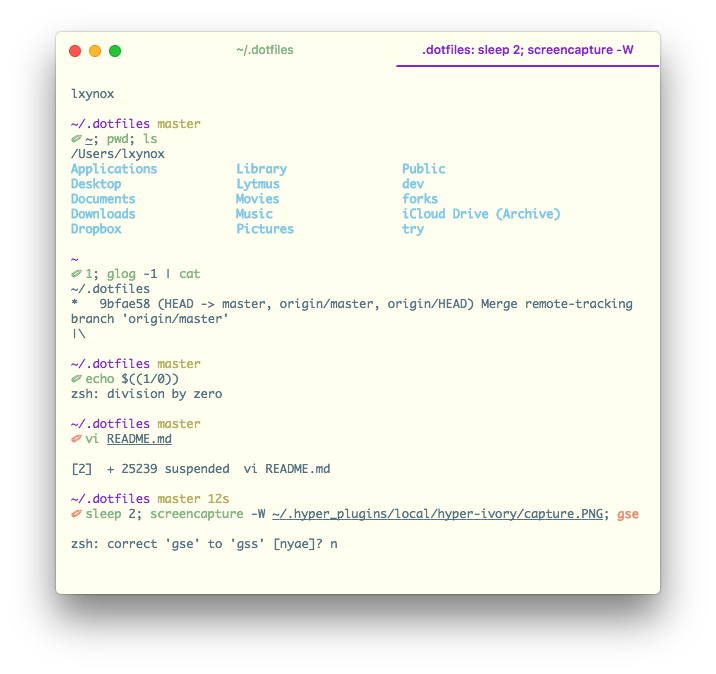

# hyper-ivory

- Yet another [hyper](https://github.com/zeit/hyper) theme
- In conjunction with [pure](https://github.com/sindresorhus/pure) zsh theme to look like above
- `solarized light` friendly for terminal apps

## How to use

Simply add `hyper-ivory` to `plugins` in `~/.hyper.js`.
